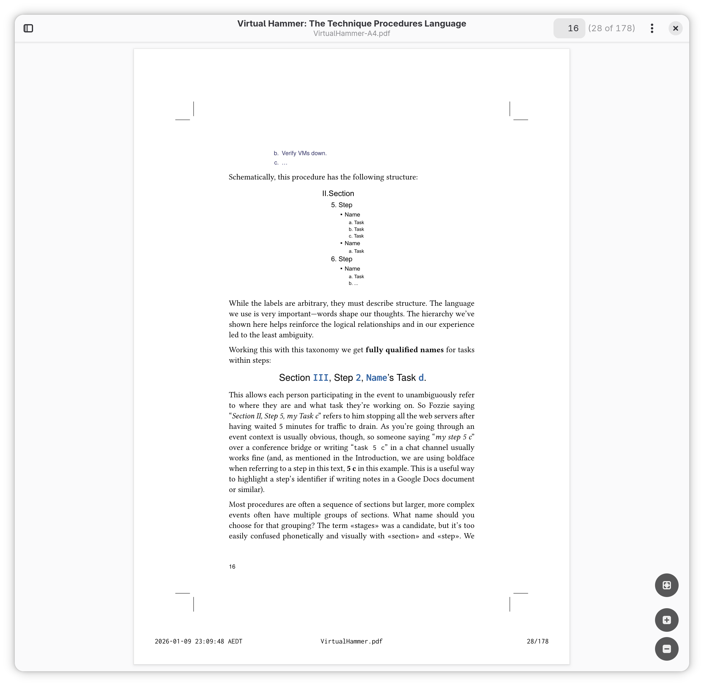

# Add Crop Marks to a Manuscript

Place each page of a PDF manuscript in trade format (6 inches × 9 inches) into
an A4 format page (210 mm × 297 mm) with crop marks at each corner. The goal
is that the resultant PDF document can be printed on A4 paper for review and
editing.

The program to do the combining is written in Rust using the **lopdf** library
to do the low-level PDF operations necessary to access each page of the input
source, translate it to the middle of the A4 page, and then merge it with a
template containing the crop marks and footer. This binary, _cropped_ can be
built with

    $ cargo build
    $ cargo run -- --help

as you would expect of a Rust program. You specify the output filename with
`-o` and then supply the filename of the manuscript you wish to print.

    $ cropped -o Output.pdf Input.pdf

The resultant PDF will have the timestamp, input filename, and page number as
shown in this example:

